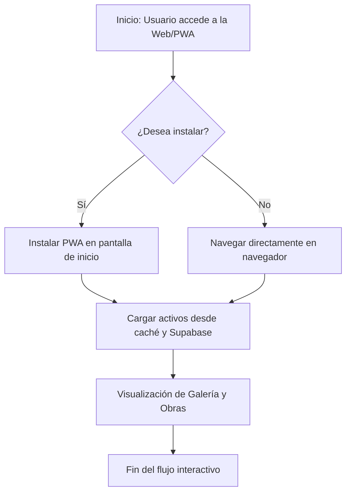
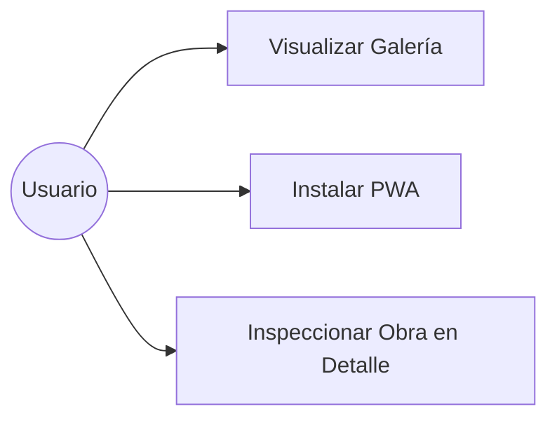
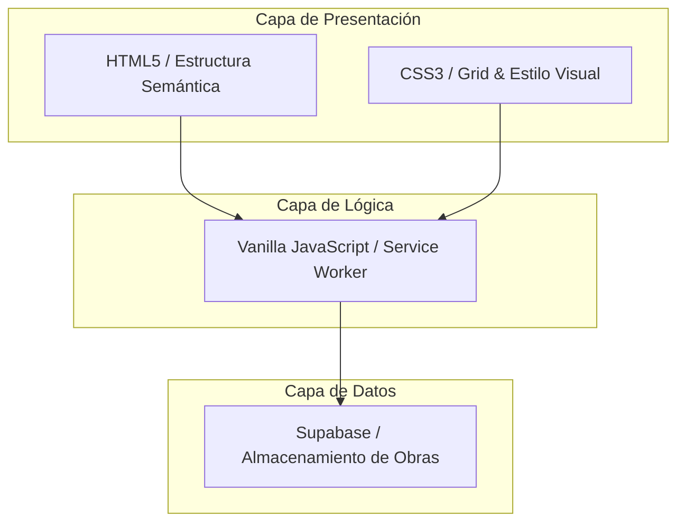
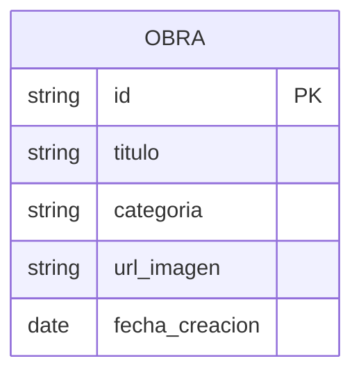
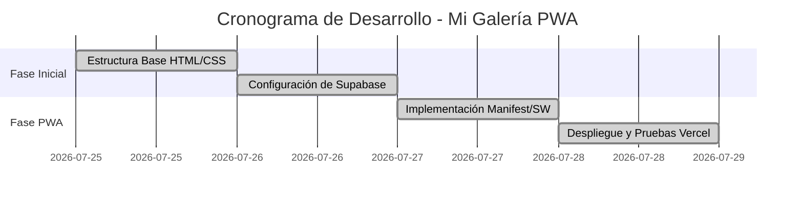

# Informe de Ingeniería: Mi Galería Digital

  
  
<i>Interfaz ergonómica adaptativa con galería integrada y soporte PWA nativo.</i>

Galería digital de libre acceso, desarrollada de manera nativa con HTML, CSS y JavaScript como una Progressive Web App (PWA) para la exhibición de obras originales de acuarelas, óleos y dibujos.

## Índice

I. Introducción

II. Identificación del Problema

III. Objetivos del Proyecto

      Objetivo General

      Objetivos Específicos

IV. Características del Negocio

V. Requerimientos del Proyecto

      Metodología (Scrum)

      Historias de Usuario

      Requerimientos funcionales y no funcionales

VI. Diseño de la Solución

      BPMN

      Casos de uso

      Componentes

      Modelo de datos

VII. Planificación del Proyecto

      Cronograma

      Product Backlog

VIII. Desarrollo

* Especificación de Arquitectura
* Descripción de las tecnologías
* Integración de las tecnologías
* Implementación de la solución
* Aplicación de métodos, estándares y buenas prácticas
* Ajuste del Cronograma
IX. Conclusiones
X. Marco Teórico y fuentes bibliográficas
XI. Referencias Bibliográficas

---

## I. Introducción

El presente informe documenta el desarrollo de una Progressive Web App (PWA) de exhibición artística, diseñada bajo el paradigma de la Ingeniería de Invisibilidad. La aplicación tiene como propósito fundamental ofrecer un espacio minimalista para la visualización de obras en acuarela, óleos y dibujos, optimizado para una navegación fluida y absoluta autonomía digital. A diferencia de las plataformas convencionales, este software se rige por el principio de mínimos recursos y máxima eficiencia, eliminando cualquier componente estético o lógico que no cumpla una función crítica demostrable. La simplicidad de su interfaz oculta una ingeniería basada en Vanilla JavaScript y CSS Grid, garantizando que la tecnología se funda con la experiencia del usuario de manera silenciosa.

## II. Identificación del Problema

En el ecosistema digital actual, las plataformas de arte suelen estar saturadas de interfaces pesadas, menús redundantes y un consumo excesivo de memoria RAM debido al uso de frameworks innecesarios. Esta "deuda técnica" y visual genera fricción en el espectador. Los problemas detectados son:

* **Distracción Visual:** Las interfaces convencionales impiden que el usuario mantenga el enfoque exclusivo en las obras expuestas.
* **Degradación del Rendimiento:** El uso excesivo de bibliotecas de terceros y elementos pesados satura el hardware en dispositivos de gama media o baja.
* **Falta de Autonomía:** Dependencia de ecosistemas cerrados que dificultan el acceso libre, rápido y multiplataforma a los trabajos visuales.

## III. Objetivos del Proyecto

### Objetivo General

Desarrollar una infraestructura de software robusta y minimalista mediante una Progressive Web App (PWA), que proporcione un entorno de exhibición artística de libre acceso. El sistema debe operar bajo el paradigma de la Optimización, garantizando una experiencia de usuario fluida y un consumo mínimo de recursos, facilitando su despliegue y ejecución en la plataforma Vercel.

### Objetivos Específicos

* **Eficiencia de Hardware:** Eliminar el uso de frameworks pesados y dependencias de terceros, utilizando exclusivamente HTML5, CSS3 y Vanilla JavaScript para asegurar la ligereza absoluta del sistema.
* **Arquitectura Cloud-Native:** Implementar una solución preparada para Vercel, aprovechando su infraestructura para garantizar disponibilidad global, seguridad SSL nativa y tiempos de carga instantáneos.
* **Ergonomía Funcional:** Diseñar una interfaz limpia que suprima elementos distractores, centrando la atención únicamente en la visualización de alta resolución de las obras.
* **Instalación Nativa (PWA):** Integrar un Web Manifest y Service Worker para permitir la instalación directa en dispositivos móviles y de escritorio.

## IV. Características del Negocio

El proyecto se define como un activo digital de acceso abierto y gratuito, diseñado para difundir creaciones artísticas sin barreras económicas ni fricción. Sus características principales son:

* **Finalidad Artística:** Herramienta de uso libre orientada a la exposición permanente de acuarelas, óleos, dibujos y obras plásticas del autor.
* **Modelo sin Fricción:** Al ser de libre acceso y no requerir registro de usuario, se elimina cualquier barrera de entrada, priorizando la visualización inmediata.
* **Ausencia de Monetización Invasiva:** El software está libre de publicidad y sistemas de rastreo comerciales, garantizando un espacio limpio y privado.
* **Bajo Costo Operativo:** Gracias a su arquitectura técnica simplificada y al despliegue en la capa gratuita de Vercel, el mantenimiento del sistema es de costo cero.

## V. Requerimientos del Proyecto

### Metodología (Scrum)

Se aplicó un Scrum de ciclo único, priorizando la agilidad y la entrega de un producto funcional inmediato.

* **Planificación:** Definición de la estructura de la galería y los recursos visuales requeridos.
* **Ejecución:** Desarrollo diario enfocado en la maquetación responsiva y la compatibilidad PWA.
* **Revisión:** Pruebas en tiempo real sobre Vercel para asegurar la velocidad de carga y la correcta persistencia de caché.

### Historias de Usuario

* **Como visitante**, quiero una interfaz sin distracciones para explorar obras originales en acuarela, dibujo y óleos con un solo click.
* **Como crítico o coleccionista**, necesito que la app consuma el mínimo de recursos para visualizar los detalles de las obras sin bloqueos.
* **Como usuario móvil**, deseo instalar la galería como una app nativa (PWA) para acceder rápidamente desde mi pantalla de inicio.

### Requerimientos Funcionales (RF)

* **RF1 - Visualización de Obras:** El sistema debe renderizar en una cuadrícula ergonómica las piezas artísticas almacenadas.
* **RF2 - Adaptabilidad Responsiva:** Redimensionamiento fluido de las imágenes según el viewport del dispositivo.
* **RF3 - Persistencia PWA:** Uso de un Manifest y Service Worker para permitir la instalación y el funcionamiento optimizado en dispositivos.

### Requerimientos No Funcionales (RNF)

* **RNF1 - Simplicidad de Código:** Desarrollo basado exclusivamente en Vanilla Stack (HTML, CSS, JS) sin compiladores.
* **RNF2 - Velocidad de Carga:** El sitio debe estar operativo en menos de 2 segundos tras el despliegue en Vercel.
* **RNF3 - Disponibilidad:** Funcionamiento garantizado 24/7 mediante infraestructura Cloud-Native.

## VI. Diseño de la Solución

En este capítulo se detalla la arquitectura lógica y funcional del sistema, orientada a la Optimización absoluta de los recursos y la eficiencia del despliegue en la nube.

### 1. BPMN (Diagrama de Procesos)

Describe el flujo de trabajo del software desde que se carga la interfaz hasta la visualización de las obras de arte.

### 2. Casos de Uso

Define las interacciones esenciales entre el usuario y la galería digital, manteniendo un enfoque directo en la exploración artística.

* Visualización: Carga de la cuadrícula de acuarelas, óleos y dibujos.
* Exploración: Detalle de piezas individuales de la colección en un carrusel que muestra las obras por categorias.
* Instalación: Anclaje del contenedor al dispositivo (PWA).

### 3. Componentes

Representa la estructura de archivos y cómo interactúan. Al no usar frameworks, la arquitectura es de acoplamiento simple:

* Capa de Presentación: HTML5 y CSS3 (Diseño Vectorial y Grid).
* Capa de Lógica: Vanilla JavaScript y Service Worker.
* Capa de Datos: Supabase (Almacenamiento de obras e imágenes).

### 4. Modelo de Datos

Estructura de datos relacional alojada en Supabase para la persistencia y gestión de las obras de arte.

## VII. Planificación del Proyecto

La planificación se centró en un Time-boxing riguroso, priorizando la velocidad de ejecución y la calidad técnica sobre la burocracia documental.

### 1. Cronograma (Sprint de Desarrollo)

El desarrollo se estructuró en hitos modulares para asegurar la integración continua en Vercel.

### 2. Product Backlog

Organizado por prioridad crítica para mantener la simplicidad del sistema:

1. [Prioridad Alta] Estructuración base nativa con HTML, CSS y JavaScript.
2. [Prioridad Alta] Configuración de arquitectura PWA (`manifest.json` y Service Worker).
3. [Prioridad Media] Creación del archivo `.gitignore` y documentación (Changelog, Contribuyendo).
4. [Prioridad Media] Configuración del despliegue (CI/CD) mediante el repositorio de GitHub hacia Vercel.
5. [Prioridad Baja] Optimización de carga inicial y transiciones en elementos visuales.

## VIII. Desarrollo

### 1. Especificación de Arquitectura

Se ha implementado una arquitectura de Cliente Delgado (Thin Client) sobre una estructura de archivos planos. El flujo de datos es unidireccional:

* Origen: Repositorios de datos en la nube y activos estáticos en Vercel.
* Procesamiento: Lógica ejecutada directamente en el navegador mediante JavaScript puro.
* Despliegue: Edge Network de Vercel para garantizar latencia cero en la entrega de activos.

### 2. Descripción de las Tecnologías

Para cumplir con el objetivo de Optimización, se seleccionaron tecnologías de estándar abierto:

* **HTML5:** Marcado semántico optimizado para accesibilidad y rendimiento.
* **CSS3 (Grid/Flexbox):** Maquetación de alta densidad visual sin librerías externas.
* **Vanilla JavaScript:** Manipulación directa del DOM y gestión del Service Worker.
* **Web Manifest & Service Workers:** Componentes clave para convertir el sitio en una PWA instalable.
* **Vercel:** Plataforma de despliegue con integración continua optimizada.

### 3. Integración de las Tecnologías

La integración se realiza mediante un script central que gestiona el ciclo de vida de la aplicación y la interacción del usuario, respaldado por un Service Worker que intercepta las peticiones de red para servir la estructura base de forma instantánea.

### 4. Implementación de la Solución

Construcción basada en el Vanilla Stack, asegurando un diseño ergonómico y un consumo mínimo de recursos computacionales.

### 5. Aplicación de métodos, estándares y buenas prácticas

* **DRY (Don't Repeat Yourself):** Centralización de la lógica para evitar redundancias de código.
* **Performance First:** Uso exclusivo de estándares nativos para máxima velocidad de renderizado.
* **Seguridad:** Encriptación y transporte seguro mediante HTTPS en Vercel.

### 6. Ajuste del Cronograma

El desarrollo se completó de manera anticipada gracias al uso de Vanilla Stack, permitiendo destinar tiempo extra a las pruebas de validación de la PWA en dispositivos móviles.

## IX. Conclusiones

Se demostró la viabilidad de construir una aplicación web progresiva de alto rendimiento y bajo consumo mediante el uso exclusivo de tecnologías nativas. La simplicidad de la arquitectura garantiza la sostenibilidad del proyecto y una experiencia de usuario impecable.

## X. Marco Teórico y fuentes bibliográficas

El sustento técnico se basa en las especificaciones oficiales de Progressive Web Apps, arquitecturas Cloud-Native Serverless y diseño ergonómico de interfaces digitales.

## XI. Referencias Bibliográficas

* W3C (2026). HTML5 and Web Apps Specification.
* Google Developers. Progressive Web Apps Documentation.
* Vercel Documentation. Deployment and Edge Network Architecture.
